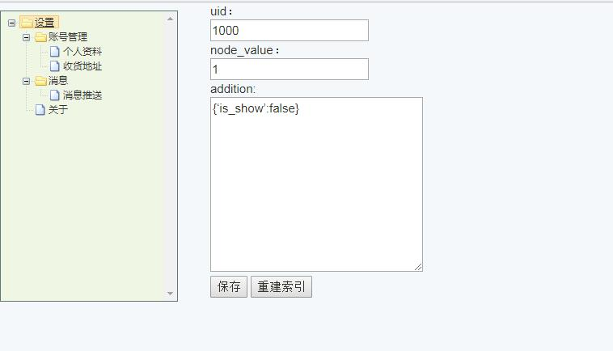

# TLRV
> 树形数据字典

## 用途
- 菜单选择
- 权限管理
- 数据库类别字段特殊含义
- 一切以父子关系关联的

## 安装
- composer安装 `composer require sowork/tlrv dev-master`
- 注册：在`config/app.php`文件中`providers`数组中注册提供者 `Sowork\TLRV\TLRVProvider::class,`

## 效果如下

